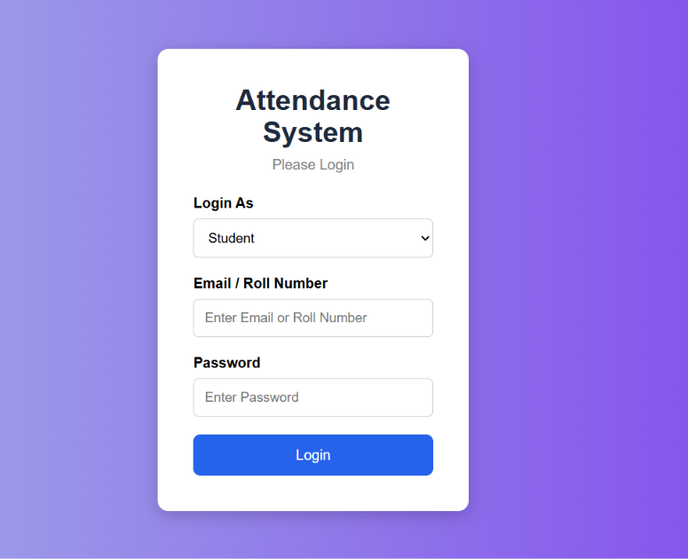
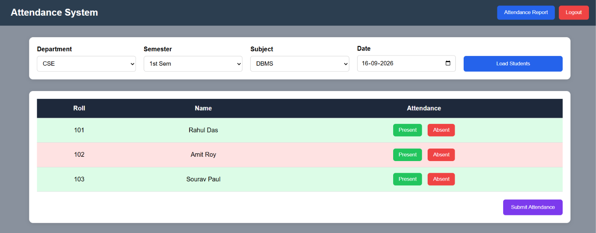
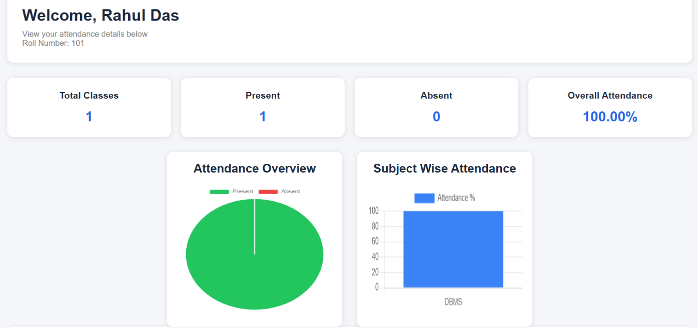
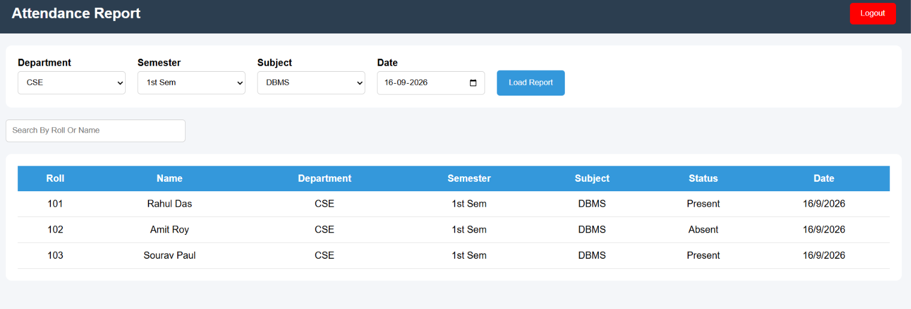

# Attendance Management System

A full-stack web-based Attendance Management System designed to manage student attendance efficiently through separate teacher and student dashboards.

The system allows teachers to manage students, mark attendance, generate attendance reports, and allows students to view their attendance records and percentage.

---

## 🚀 Live Demo

**Live Website:** https://attendance-system-frontend.netlify.app/

**GitHub Repository:** https://github.com/Arunava2006webdev/Attendance-System

**Demo Video:** Add your demo video link here

---

## 📌 Project Overview

The Attendance Management System is a full-stack web application developed to simplify attendance management for educational institutions.

Teachers can log in, select a department and semester, view students, mark attendance, and generate attendance reports.

Students can log in using their assigned credentials and view their attendance details, including total classes, present/absent classes, attendance percentage, and attendance charts.

The application is deployed online with a separate frontend, backend, and cloud database.

---

## ✨ Features

### 👨‍🏫 Teacher Features

- Teacher login
- Department selection
- Semester selection
- View students based on department and semester
- Mark students as Present or Absent
- Submit attendance
- Prevent duplicate attendance for the same student, subject, and date
- View attendance reports
- Filter attendance reports
- Teacher logout

### 👨‍🎓 Student Features

- Student login using assigned credentials
- View student name and roll number
- View attendance records
- View total classes
- View present classes
- View absent classes
- Calculate attendance percentage
- Attendance visualization using charts
- Student logout

### 🔐 Authentication

- Separate teacher and student login
- Student information is retrieved from the database
- Student login information is stored temporarily using browser localStorage
- No public registration is required
- Accounts are created/provided by the institution

---

## 🛠️ Technologies Used

### Frontend

- HTML5
- CSS3
- JavaScript
- Chart.js

### Backend

- Node.js
- Express.js
- CORS
- REST API

### Database

- MySQL-compatible TiDB Cloud

### Deployment

- Netlify - Frontend
- Render - Backend
- TiDB Cloud - Database

### Development Tools

- Visual Studio Code
- Git
- GitHub
- MySQL Workbench
- Postman

---

## 🏗️ System Architecture

```text
                    ┌─────────────────────┐
                    │       Netlify       │
                    │      Frontend       │
                    │   HTML/CSS/JS       │
                    └──────────┬──────────┘
                               │
                               │ REST API
                               ↓
                    ┌─────────────────────┐
                    │       Render        │
                    │   Node.js + Express │
                    │       Backend       │
                    └──────────┬──────────┘
                               │
                               │ SQL Queries
                               ↓
                    ┌─────────────────────┐
                    │     TiDB Cloud      │
                    │  MySQL-compatible   │
                    │      Database       │
                    └─────────────────────┘
📂 Project Structure
Attendance-System/
│
├── Backend/
│   ├── db.js
│   ├── server.js
│   ├── package.json
│
│
├── Frontend/
│   ├── index.html
│   ├── teacher-dashboard.html
│   ├── student-dashboard.html
│   ├── attendance-report.html
│   │
│   ├── css/
│   │   └── ...
│   │
│   └── js/
│       └── ...
│
├── README.md
└── .gitignore

🗄️ Database Structure

The application uses the following database:

attendance_system
│
├── students
├── teachers
└── attendance
Students Table

Stores student information such as:

Student ID
Roll number
Name
Password
Department
Semester
Teachers Table

Stores teacher login information:

Teacher ID
Email
Password
Attendance Table

Stores attendance records:

Attendance ID
Student roll number
Subject
Attendance status
Date
Department
Semester

🔌 API Endpoints
Teacher / Student Login
POST /login

Used for both teacher and student authentication.

Get Students
GET /students?department=CSE&semester=1st%20Sem

Returns students based on department and semester.

Mark Attendance
POST /attendance

Stores attendance information in the database.

Get Student Attendance
GET /student-attendance/:roll

Returns attendance records for a particular student.

Attendance Report
GET /report

Returns attendance records according to the selected filters.

🔄 Application Workflow
Teacher Workflow
Teacher Login
      ↓
Select Department
      ↓
Select Semester
      ↓
Load Students
      ↓
Mark Present / Absent
      ↓
Submit Attendance
      ↓
Attendance Stored in Database
      ↓
View Attendance Report
Student Workflow
Student Login
      ↓
Student Dashboard
      ↓
Fetch Attendance Records
      ↓
Calculate Attendance
      ↓
Display Percentage
      ↓
Display Charts and Records

⚙️ Local Setup
1. Clone the repository
git clone https://github.com/Arunava2006webdev/Attendance-System.git
2. Open the project
cd Attendance-System
3. Install backend dependencies
cd Backend
npm install
4. Create .env
Create a .env file inside the Backend folder.


5. Start the backend
node server.js

The backend will run on:

http://localhost:3000
6. Run the frontend

Open:

Frontend/index.html

in a browser.

🌐 Deployment

The application is deployed using:

Component	Platform
Frontend	Netlify
Backend	    Render
Database	TiDB Cloud

The frontend communicates with the Express backend using REST APIs.

The Express backend communicates with the TiDB Cloud database using mysql2.

🔒 Security Notes
Database credentials are stored using environment variables.
.env is excluded from GitHub using .gitignore.
No database password is included in this repository.
The project uses institution-provided accounts instead of public registration.
For a production system, passwords should be securely hashed using a password hashing algorithm such as bcrypt.

🔮 Future Improvements

Possible improvements include:

Secure password hashing with bcrypt
JWT-based authentication
Role-based access control
Admin dashboard
Add/edit/delete students
Add/edit/delete teachers
Attendance editing
Export attendance reports to PDF
Export reports to Excel
Email notifications
Monthly and semester-wise attendance analytics
Improved mobile responsiveness
Database backup and recovery
More advanced authentication and authorization

🎥 Project Demo
📸 Screenshots

Login Page

Teacher Dashboard

Student Dashboard

Attendance Report



👨‍💻 Author
Arunava Mandal

B.Tech Computer Science and Engineering Student

GitHub: https://github.com/Arunava2006webdev

Portfolio: https://arunavaportfolio.netlify.app/

LinkedIn: https://www.linkedin.com/in/arunava-mandal-891a50307/
```
